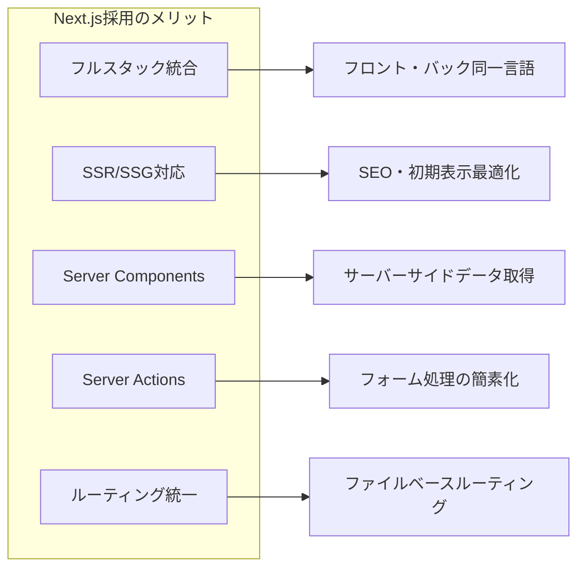
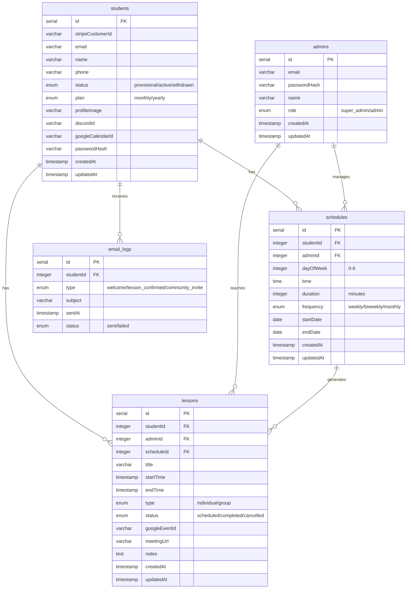
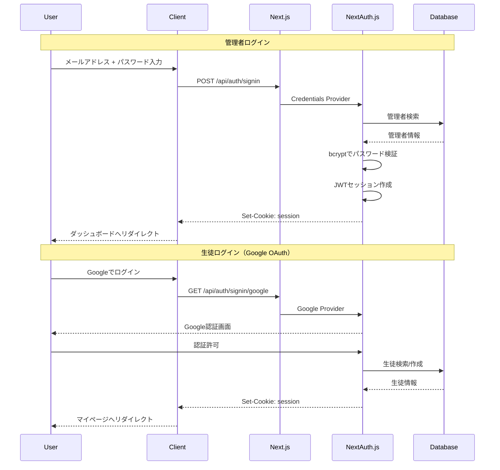
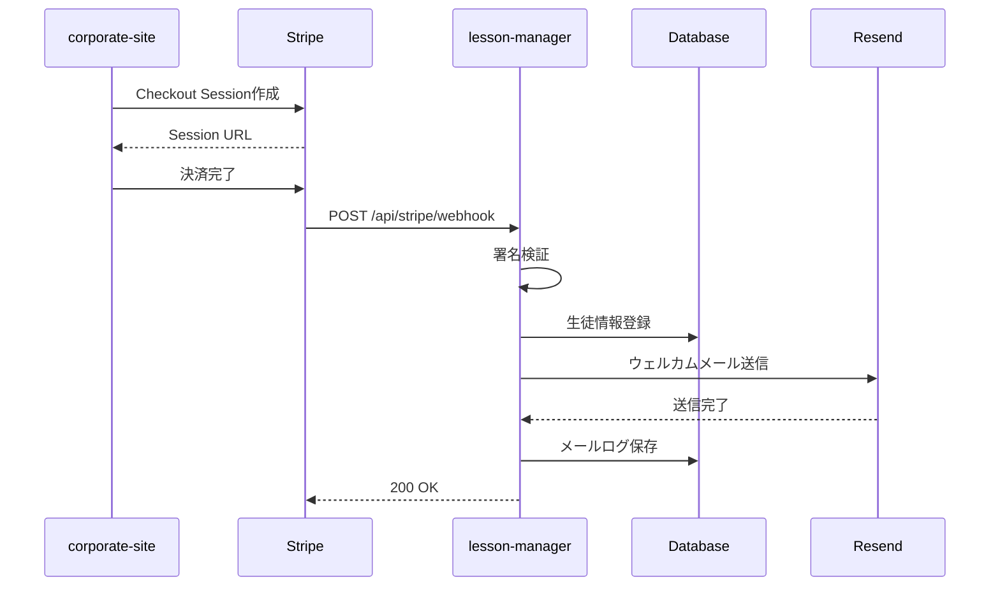
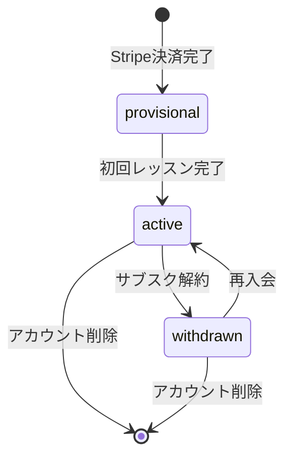

# 生徒・レッスン管理システム アーキテクチャ設計書

## 1. システム構成概要

```mermaid
graph TB
    subgraph Client["Client Layer"]
        A1[管理者向けUI]
        A2[生徒向けUI]
        A3[corporate-site]
    end

    subgraph LM["lesson-manager (Next.js)"]
        subgraph Pages["App Router"]
            P1[/admin/*]
            P2[/student/*]
            P3[/api/*]
        end
        subgraph Server["Server Components / Actions"]
            SA[Server Actions]
            RC[React Server Components]
        end
        subgraph API["API Routes"]
            R1[/api/auth]
            R2[/api/stripe/webhook]
            R3[/api/trpc]
        end
    end

    subgraph External["External Services"]
        E1[(PostgreSQL<br/>Neon)]
        E2[Stripe]
        E3[Google Calendar]
        E4[Resend]
    end

    A1 --> P1
    A2 --> P2
    A3 --> E2

    SA --> E1
    RC --> E1
    R1 --> E1
    R2 --> E1
    R3 --> E1

    SA --> E3
    SA --> E4
    E2 -->|Webhook| R2
```

## 2. 技術スタック

### 2.1 フレームワーク
| 技術 | バージョン | 用途 |
|------|-----------|------|
| Next.js | 15.x | フルスタックフレームワーク |
| React | 19.x | UIライブラリ |
| TypeScript | 5.x | 型システム |

### 2.2 フロントエンド
| 技術 | バージョン | 用途 |
|------|-----------|------|
| Tailwind CSS | 4.x | スタイリング |
| shadcn/ui | - | UIコンポーネント |
| TanStack Query | 5.x | クライアント状態管理（必要時） |
| react-hook-form | 7.x | フォーム管理 |
| date-fns | 4.x | 日付操作 |

### 2.3 バックエンド
| 技術 | バージョン | 用途 |
|------|-----------|------|
| Server Actions | - | データ更新処理 |
| Server Components | - | データ取得・SSR |
| tRPC | 11.x | 型安全API（クライアント用） |
| Drizzle ORM | 0.44.x | データベースORM |
| Zod | 4.x | バリデーション |
| jose | 6.x | JWT処理 |
| googleapis | - | Google Calendar連携 |
| Resend | 6.x | メール送信 |

### 2.4 データベース・インフラ
| 技術 | 用途 |
|------|------|
| PostgreSQL | メインデータベース（Neon） |
| Railway | アプリケーションホスティング |

## 3. Next.js採用の理由



| 観点 | Express + React | Next.js |
|------|-----------------|---------|
| プロジェクト構成 | 分離（client/server） | 統合 |
| データ取得 | useEffect + fetch | Server Components |
| フォーム送信 | API呼び出し | Server Actions |
| SSR | 別途設定必要 | 標準搭載 |
| ルーティング | 別々に定義 | App Router統一 |

## 4. ディレクトリ構造

```
lesson-manager/
├── REQUIREMENTS.md          # 要件定義書
├── ARCHITECTURE.md          # 本ドキュメント
├── CLAUDE.md                # 開発ガイド
├── package.json
├── tsconfig.json
├── next.config.ts
├── tailwind.config.ts
│
├── app/                     # Next.js App Router
│   ├── layout.tsx           # ルートレイアウト
│   ├── page.tsx             # トップページ（リダイレクト）
│   │
│   ├── (auth)/              # 認証グループ
│   │   ├── login/
│   │   │   └── page.tsx     # 共通ログインページ
│   │   └── layout.tsx
│   │
│   ├── admin/               # 管理者向けページ
│   │   ├── layout.tsx       # 管理者レイアウト
│   │   ├── page.tsx         # ダッシュボード
│   │   ├── students/
│   │   │   ├── page.tsx     # 生徒一覧
│   │   │   └── [id]/
│   │   │       └── page.tsx # 生徒詳細
│   │   ├── schedule/
│   │   │   └── page.tsx     # スケジュール管理
│   │   └── settings/
│   │       └── page.tsx     # 設定
│   │
│   ├── student/             # 生徒向けページ
│   │   ├── layout.tsx       # 生徒レイアウト
│   │   ├── page.tsx         # マイページ
│   │   ├── schedule/
│   │   │   └── page.tsx     # スケジュール確認
│   │   └── profile/
│   │       └── page.tsx     # プロフィール編集
│   │
│   └── api/                 # API Routes
│       ├── auth/
│       │   └── [...nextauth]/
│       │       └── route.ts # NextAuth.js
│       ├── stripe/
│       │   └── webhook/
│       │       └── route.ts # Stripe Webhook
│       └── trpc/
│           └── [trpc]/
│               └── route.ts # tRPCエンドポイント
│
├── components/              # 共通コンポーネント
│   ├── ui/                  # shadcn/ui
│   ├── layout/              # レイアウトコンポーネント
│   │   ├── AdminSidebar.tsx
│   │   ├── StudentHeader.tsx
│   │   └── ...
│   ├── calendar/            # カレンダー関連
│   └── forms/               # フォームコンポーネント
│
├── lib/                     # ユーティリティ・設定
│   ├── db.ts                # Drizzle接続
│   ├── auth.ts              # 認証設定
│   ├── trpc.ts              # tRPCクライアント
│   └── utils.ts             # 汎用ユーティリティ
│
├── server/                  # サーバーサイドロジック
│   ├── actions/             # Server Actions
│   │   ├── students.ts
│   │   ├── lessons.ts
│   │   ├── schedules.ts
│   │   └── calendar.ts
│   ├── services/            # ビジネスロジック
│   │   ├── student.service.ts
│   │   ├── lesson.service.ts
│   │   ├── calendar.service.ts
│   │   └── mail.service.ts
│   ├── trpc/                # tRPCルーター
│   │   ├── router.ts
│   │   └── procedures/
│   └── templates/           # メールテンプレート
│       ├── welcome.tsx
│       ├── lessonConfirmed.tsx
│       └── communityInvite.tsx
│
├── drizzle/                 # データベーススキーマ
│   ├── schema.ts
│   ├── relations.ts
│   └── migrations/
│
└── types/                   # 型定義
    └── index.ts
```

## 5. データベース設計

### 5.1 ER図



### 5.2 テーブル定義

#### students（生徒）
| カラム名 | 型 | NULL | 説明 |
|----------|------|------|------|
| id | serial | NO | 主キー |
| stripeCustomerId | varchar(255) | NO | Stripe顧客ID |
| email | varchar(320) | NO | メールアドレス |
| name | varchar(100) | NO | 氏名 |
| phone | varchar(20) | YES | 電話番号 |
| status | enum | NO | 仮登録/本登録/退会 |
| plan | enum | NO | 月額/年額 |
| profileImage | varchar(512) | YES | プロフィール画像URL |
| discordId | varchar(100) | YES | Discord ID |
| googleCalendarId | varchar(100) | YES | Googleカレンダー連携ID |
| passwordHash | varchar(255) | YES | パスワードハッシュ |
| createdAt | timestamp | NO | 作成日時 |
| updatedAt | timestamp | NO | 更新日時 |

#### admins（管理者）
| カラム名 | 型 | NULL | 説明 |
|----------|------|------|------|
| id | serial | NO | 主キー |
| email | varchar(320) | NO | メールアドレス |
| passwordHash | varchar(255) | NO | パスワードハッシュ |
| name | varchar(100) | NO | 氏名 |
| role | enum | NO | super_admin/admin |
| createdAt | timestamp | NO | 作成日時 |
| updatedAt | timestamp | NO | 更新日時 |

#### lessons（レッスン）
| カラム名 | 型 | NULL | 説明 |
|----------|------|------|------|
| id | serial | NO | 主キー |
| studentId | integer | NO | 生徒ID（FK） |
| adminId | integer | NO | 担当管理者ID（FK） |
| scheduleId | integer | YES | 定期スケジュールID（FK） |
| title | varchar(255) | NO | レッスンタイトル |
| startTime | timestamp | NO | 開始日時 |
| endTime | timestamp | NO | 終了日時 |
| type | enum | NO | individual/group |
| status | enum | NO | scheduled/completed/cancelled |
| googleEventId | varchar(255) | YES | GoogleカレンダーイベントID |
| meetingUrl | varchar(512) | YES | ミーティングURL |
| notes | text | YES | 備考 |
| createdAt | timestamp | NO | 作成日時 |
| updatedAt | timestamp | NO | 更新日時 |

#### schedules（定期スケジュール）
| カラム名 | 型 | NULL | 説明 |
|----------|------|------|------|
| id | serial | NO | 主キー |
| studentId | integer | NO | 生徒ID（FK） |
| adminId | integer | NO | 担当管理者ID（FK） |
| dayOfWeek | integer | NO | 曜日（0-6） |
| time | time | NO | 時刻 |
| duration | integer | NO | 時間（分） |
| frequency | enum | NO | weekly/biweekly/monthly |
| startDate | date | NO | 開始日 |
| endDate | date | YES | 終了日 |
| createdAt | timestamp | NO | 作成日時 |
| updatedAt | timestamp | NO | 更新日時 |

#### email_logs（メール送信ログ）
| カラム名 | 型 | NULL | 説明 |
|----------|------|------|------|
| id | serial | NO | 主キー |
| studentId | integer | NO | 生徒ID（FK） |
| type | enum | NO | welcome/lesson_confirmed/community_invite等 |
| subject | varchar(255) | NO | 件名 |
| sentAt | timestamp | NO | 送信日時 |
| status | enum | NO | sent/failed |

## 6. データ取得・更新パターン

### 6.1 Server Components によるデータ取得

```typescript
// app/admin/students/page.tsx
import { db } from '@/lib/db';
import { students } from '@/drizzle/schema';

export default async function StudentsPage() {
  // サーバーサイドで直接DBアクセス
  const studentList = await db.select().from(students);

  return (
    <div>
      {studentList.map(student => (
        <StudentCard key={student.id} student={student} />
      ))}
    </div>
  );
}
```

### 6.2 Server Actions によるデータ更新

```typescript
// server/actions/students.ts
'use server';

import { db } from '@/lib/db';
import { students } from '@/drizzle/schema';
import { revalidatePath } from 'next/cache';
import { z } from 'zod';

const updateProfileSchema = z.object({
  name: z.string().min(1),
  phone: z.string().optional(),
});

export async function updateProfile(formData: FormData) {
  const data = updateProfileSchema.parse({
    name: formData.get('name'),
    phone: formData.get('phone'),
  });

  await db.update(students)
    .set(data)
    .where(eq(students.id, getCurrentUserId()));

  revalidatePath('/student/profile');
}
```

### 6.3 tRPC（クライアントからの動的操作用）

```typescript
// server/trpc/router.ts
import { router, adminProcedure } from './trpc';

export const appRouter = router({
  lessons: {
    list: adminProcedure
      .input(z.object({
        startDate: z.date(),
        endDate: z.date(),
      }))
      .query(async ({ input }) => {
        return lessonService.list(input);
      }),
  },
});
```

## 7. 認証・認可

### 7.1 認証フロー



### 7.2 認可（Middleware）

```typescript
// middleware.ts
import { withAuth } from 'next-auth/middleware';

export default withAuth({
  callbacks: {
    authorized: ({ token, req }) => {
      const path = req.nextUrl.pathname;

      if (path.startsWith('/admin')) {
        return token?.role === 'admin' || token?.role === 'super_admin';
      }
      if (path.startsWith('/student')) {
        return token?.role === 'student';
      }
      return true;
    },
  },
});

export const config = {
  matcher: ['/admin/:path*', '/student/:path*'],
};
```

### 7.3 認可ルール

| ロール | アクセス可能リソース |
|--------|---------------------|
| super_admin | 全リソース |
| admin | 生徒管理、レッスン管理、スケジュール管理 |
| student | 自分のプロフィール、自分のスケジュール |

## 8. 外部サービス連携

### 8.1 Stripe Webhook フロー



### 8.2 Google Calendar連携

```typescript
// server/services/calendar.service.ts
import { google } from 'googleapis';

export class CalendarService {
  private calendar: calendar_v3.Calendar;

  constructor() {
    const auth = new google.auth.OAuth2(
      process.env.GOOGLE_CLIENT_ID,
      process.env.GOOGLE_CLIENT_SECRET,
      process.env.GOOGLE_REDIRECT_URI
    );
    this.calendar = google.calendar({ version: 'v3', auth });
  }

  async createEvent(lesson: Lesson) {
    const event = await this.calendar.events.insert({
      calendarId: 'primary',
      requestBody: {
        summary: lesson.title,
        start: { dateTime: lesson.startTime.toISOString() },
        end: { dateTime: lesson.endTime.toISOString() },
        conferenceData: {
          createRequest: { requestId: nanoid() }
        },
      },
      conferenceDataVersion: 1,
    });
    return event.data;
  }
}
```

### 8.3 メール送信（React Email）

```typescript
// server/services/mail.service.ts
import { Resend } from 'resend';
import { WelcomeEmail } from '../templates/welcome';

const resend = new Resend(process.env.RESEND_API_KEY);

export async function sendWelcome(student: Student) {
  await resend.emails.send({
    from: 'PrimaMateria <noreply@primamateria.co.jp>',
    to: student.email,
    subject: '【PrimaMateria】ご入会ありがとうございます',
    react: <WelcomeEmail student={student} />,
  });
}
```

## 9. 生徒ステータス遷移



## 10. デプロイ構成

### 10.1 環境変数

```env
# Database
DATABASE_URL=postgresql://...

# NextAuth
NEXTAUTH_URL=https://manager.primamateria.co.jp
NEXTAUTH_SECRET=...

# Stripe
STRIPE_SECRET_KEY=sk_...
STRIPE_WEBHOOK_SECRET=whsec_...

# Google
GOOGLE_CLIENT_ID=...
GOOGLE_CLIENT_SECRET=...

# Mail
RESEND_API_KEY=re_...

# App
NODE_ENV=production
```

### 10.2 Railway構成

```toml
# railway.toml
[build]
  builder = "NIXPACKS"
  buildCommand = "pnpm build"

[deploy]
  startCommand = "pnpm start"
  healthcheckPath = "/api/health"
  healthcheckTimeout = 10
```

## 11. セキュリティ対策

| 対策 | 実装方法 |
|------|---------|
| XSS | React自動エスケープ、CSP |
| CSRF | Server Actions自動対策 |
| SQLi | Drizzle ORMによるパラメータ化 |
| 認証 | NextAuth.js |
| パスワード | bcryptハッシュ化 |
| HTTPS | Railwayで自動設定 |
| Rate Limit | Middleware |

## 12. 将来の拡張性

### 12.1 検討事項
- 複数講師対応
- グループレッスンの本格化
- 決済プランの多様化
- 学習進捗管理機能
- レポート・分析機能
- モバイルアプリ対応（React Native / Expo）

### 12.2 アーキテクチャの柔軟性
- App Routerによる柔軟なルーティング
- Server Components/Actionsによる効率的なデータ処理
- サービス層の分離により外部連携の差し替えが可能
